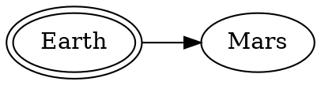

# その他の機能

特に断りのない限り，以下の拡張パッケージによって自由度の高い表現を実現できるようになります。詳しくは[こちら](https://facelessuser.github.io/pymdown-extensions/)に説明あり。

ソース：https://github.com/facelessuser/pymdown-extensions

## 文字の装飾いろいろ

`mkdocs.yml`に以下を追加すると以下の装飾ができます。

- 取り消し線
- 下線
- シンボル
- 絵文字
- すべての文字に対するエスケープ
- 強調表示
- ショートカットキー
- インラインハイライト

```yaml
markdown_extensions:
    - pymdownx.tilde:
    - pymdownx.caret:
    - pymdownx.betterem:
    - pymdownx.smartsymbols:
    - pymdownx.emoji:
        emoji_index: !!python/name:materialx.emoji.twemoji
        emoji_generator: !!python/name:materialx.emoji.to_svg
    - pymdownx.escapeall:
        hardbreak: True
        nbsp: True
    - pymdownx.mark:
    - pymdownx.keys:
        separator: "\uff0b"
```

機能| 出力結果 | Markdown
---|---|---
取り消し線 |あいうえお ~~かきくけこ~~ |`あいうえお ~~かきくけこ~~`
下線 |さしすせそ ^^たちつてと^^ |`さしすせそ ^^たちつてと^^`
斜体 | なにぬねの *はひふへほ* | `なにぬねの *はひふへほ*`
シンボルマーク |(tm) (c) (r) c/o +/- --> <-- <--> =/= 1/4. etc. 1st 2nd 3rd |`(tm) (c) (r) c/o +/- --> <-- <--> =/= 1/4. etc. 1st 2nd 3rd`
絵文字 |:smile: :heart: :thumbsup: |`:smile: :heart: :thumbsup:`
文字のエスケープ |\W\e\ \c\a\n\ \e\s\c\a\p\e \e\v\e\r\y\t\h\i\n\g\! |`\W\e\ \c\a\n\ \e\s\c\a\p\e \e\v\e\r\y\t\h\i\n\g\!`
強調表示 | ==強調表示== | `==強調表示==`
ショートカットキー | ++ctrl+alt+delete++ | `++ctrl+alt+delete++`

## タブ

`mkdocs.yml`に以下を追加すると文章中にタブを作れます。ただし，すべての機能がタブで実現できるようではないようです。pymdownに含まれていない拡張機能(plantumlなど)はダメなケースがあります。

```yaml
markdown_extensions:
    - pymdownx.tabbed:
    - pymdownx.superfences:
        preserve_tabs: true
```

`superfences`を入れておくと，タブの中でもフェンス内の記述を改行してくれます。(逆にこれがないと改行しない。)

=== "Fruit List"
    - :apple: Apple
    - :banana: Banana
    - :kiwi: Kiwi

=== "Fruit Table"
    Fruit           | Color
    --------------- | -----
    :apple:  Apple  | Red
    :banana: Banana | Yellow
    :kiwi:   Kiwi   | Green

## チェックボックス

`mkdocs.yml`に以下を追加するとチェックボックスを表示できます。

```yaml
markdown_extensions:
    - pymdownx.tasklist:
        custom_checkbox: true
```

=== "出力結果"
    * [x] aaa
    * [x] bbb
    * [x] ccc
    * [ ] ddd
        * [x] AAA
        * [ ] BBB
        * [x] CCC
    * [ ] eee
=== "Markdown"
    ```
    * [x] aaa
    * [x] bbb
    * [x] ccc
    * [ ] ddd
        * [x] AAA
        * [ ] BBB
        * [x] CCC
    * [ ] eee
    ```

## スニペット

`mkdocs.yml`に以下を追加すると，マークダウンの中にマークダウンを挿入できます。

```yaml
markdown_extensions:
    - pymdownx.snippets:
        base_path: docs/
```

使い方は以下の通り。

<pre><code>--8&lt;--
filename.md
filename2.md
--8&lt;--</code></pre>

## 詳細表示

`mkdocs.yml`に以下を追加すると，クリックで詳細を表示するような表現ができます。詳細表示は初めから開いた状態と閉じた状態を指定でき，入れ子で挿入することもできます。

```yaml
markdown_extensions:
    - pymdownx.details:
```

=== "出力結果"
    ???+ note "詳細を表示"
        ??? danger "入れ子で詳細表示"
            入れ子もできます。

=== "Markdown"
    ```
    ???+ note "詳細を表示"
        ??? danger "入れ子で詳細表示"
            入れ子もできます。
    ```

## 数式サポート

`mkdocs.yml`に以下を追加します。

```yaml
extra_javascript: 
    - http://cdn.mathjax.org/mathjax/latest/MathJax.js?config=TeX-AMS-MML_HTMLorMML
markdown_extensions:
    - mdx_math
```

=== "出力結果"
    $$
    \begin{align}
        \dot{x} &= A x + B u \\
        y &= C x
    \end{align}
    $$
=== "Markdown"
    ```md
    $$
    \begin{align}
        \dot{x} &= A x + B u \\
        y &= C x
    \end{align}
    $$
    ```

## plantuml

plantumlも描画できます。描画にはplantuml描画用のサーバーを用意する必要があります。  serverにはローカルで建てたサーバーも設定できます。

ソース：https://github.com/mikitex70/plantuml-markdown

`mkdocs.yml`の記述は以下の通りです。

```yaml
markdown_extensions:
    - plantuml_markdown:
        server: http://www.plantuml.com/plantuml
```

::uml:: format="svg" classes="uml myDiagram" alt="My super diagram placeholder" 
@startmindmap
* Debian
** Ubuntu
*** Linux Mint
*** Kubuntu
*** Lubuntu
*** KDE Neon
** LMDE
** SolydXK
** SteamOS
** Raspbian with a very long name
*** <s>Raspmbc</s> => OSMC
*** <s>Raspyfi</s> => Volumio
@endmindmap
::end-uml::

```md
::uml:: format="svg" classes="uml myDiagram" alt="My super diagram placeholder" 
@startmindmap
* Debian
** Ubuntu
*** Linux Mint
*** Kubuntu
*** Lubuntu
*** KDE Neon
** LMDE
** SolydXK
** SteamOS
** Raspbian with a very long name
*** <s>Raspmbc</s> => OSMC
*** <s>Raspyfi</s> => Volumio
@endmindmap
::end-uml::
```

## graphviz

graphvizもいけます。dotファイルは別書きしたいところですが，そこまではまだ調べ切れてません。

ソース：https://github.com/cesaremorel/markdown-inline-graphviz


`mkdocs.yml`の記述は以下の通り。

```yaml
markdown_extensions:
    - markdown_inline_graphviz
```



<pre><code>```graphviz dot graph.svg
digraph G {
    rankdir=LR
    Earth [peripheries=2]
    Mars
    Earth -> Mars
}</code></pre>


